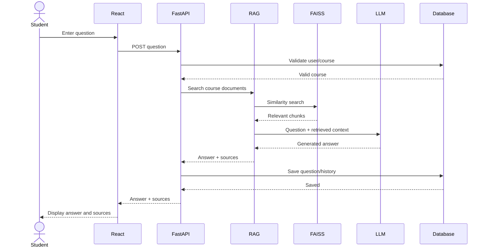

# Sequence Diagram

```mermaid
sequenceDiagram

    actor Student
    participant React
    participant FastAPI
    participant RAG
    participant FAISS
    participant LLM
    participant Database

    Student->>React: Enter question
    React->>FastAPI: POST question
    FastAPI->>Database: Validate user/course
    Database-->>FastAPI: Valid course

    FastAPI->>RAG: Search course documents
    RAG->>FAISS: Similarity search
    FAISS-->>RAG: Relevant chunks

    RAG->>LLM: Question + retrieved context
    LLM-->>RAG: Generated answer

    RAG-->>FastAPI: Answer + sources

    FastAPI->>Database: Save question/history
    Database-->>FastAPI: Saved

    FastAPI-->>React: Answer + sources
    React-->>Student: Display answer and sources
```