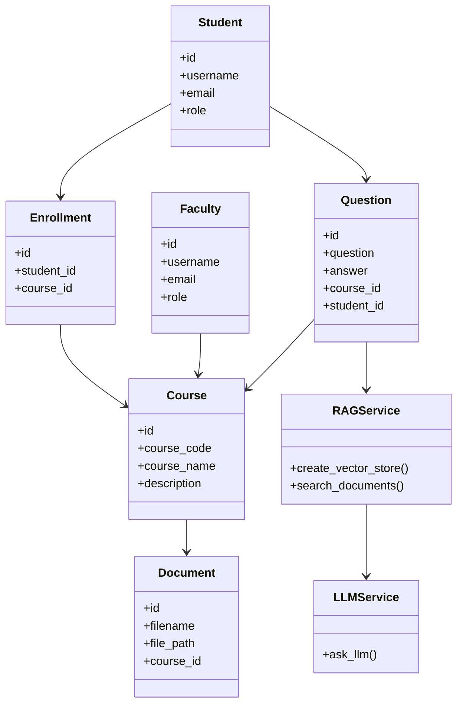

## VOPC Diagram

```mermaid
classDiagram

    class Student {
        +id
        +username
        +email
        +role
    }

    class Faculty {
        +id
        +username
        +email
        +role
    }

    class Course {
        +id
        +course_code
        +course_name
        +description
    }

    class Enrollment {
        +id
        +student_id
        +course_id
    }

    class Document {
        +id
        +filename
        +file_path
        +course_id
    }

    class Question {
        +id
        +question
        +answer
        +course_id
        +student_id
    }

    class RAGService {
        +create_vector_store()
        +search_documents()
    }

    class LLMService {
        +ask_llm()
    }

    Student --> Enrollment
    Enrollment --> Course
    Faculty --> Course
    Course --> Document
    Student --> Question
    Question --> Course
    Question --> RAGService
    RAGService --> LLMService
```